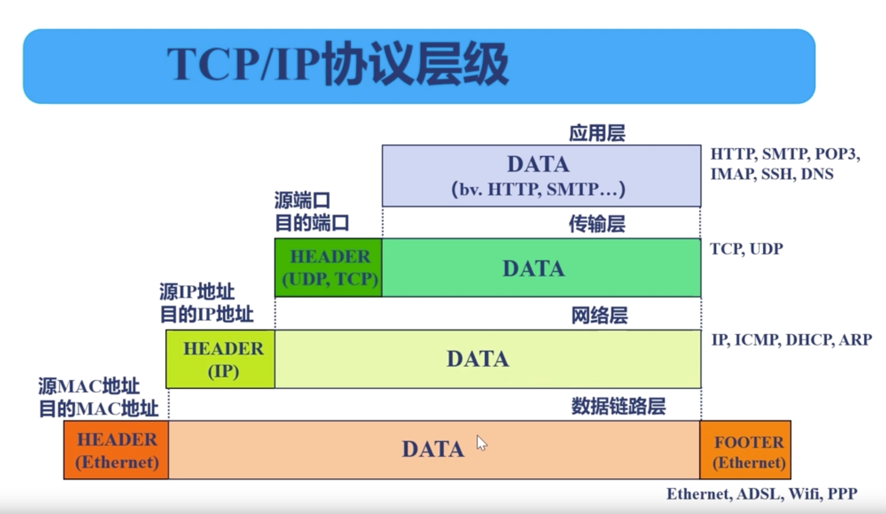
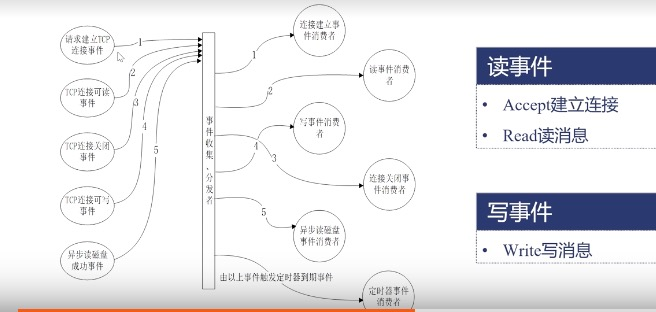

我们从一个请求到一个应用。比如我们从主机A发送请求经过路由器到主机B

主机A-->路由器-->路由器-->主机B

从数据流分析：

1、应用层：我们从应用层发送一个`get`请求

2、传输层：只做一件事情，浏览器打开了一个端口以及nginx也打开了一个端口（80/443），记录下来;

3、网络层：会记录下我们主机的ip和目标主机所在的IP

4、链路层：经过以太网到达路由器，路由器会记录运营商的下一段的ip。经过广域网以后，最终会跳转到主机B所在的机器中

5、这个时候报文会经过链路层，网路层，传输层。
到这里操作系统会知道是打开443端口的那个应用，就会去找nginx。nginx就是在他的http状态处理机里面就会处理，应用层就会处理

# TCP流与报文

**网络报文扮演了一个怎么样的角色呢**

tcp报文:
1、数据链路层：它会在我们数据的两端加上header部分和footer部分添加上我们的mac地址，（源MAC地址和目的主机目标地址）
2、网络层：是我们nginx的公网地址（也就是我们目标主机的额IP地址和源IP地址），
3、传输层：tcp层是我们浏览器打开的端口，nginx打开的端口
4、应用层就是我们nginx协议

上面就是一个报文
 

# TCP协议与非阻塞接口

1、请求建立TCP链接事件，实际上是发送了一个tcp报文(读事件，因为对于nginx来说我读取了一个nginx报文)

2、TCP链接可读事件，我们发送一个消息，对于nginx来讲也是一个读事件

3、TCP链接关闭事件，对于nginx还是一个读事件

那什么样是写事件

当nginx想浏览器发送我们的相应，我们需要把消息写入到操作系统中，操作系统将消息发送到网络中 

> 事件手机分发器：定义事件消费者

KERNEL