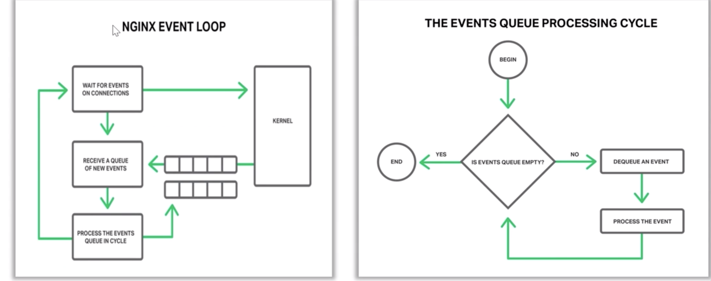

我们在启动nginx时候，我们在WAIT FOR EVENTS ON CONNECTIONS，我们打开了80或者443端口，这个时候我们在等待新的事件进来，比如新的客户端连上我们的nginx,这个事件往往对应着我们的epoll的epoll_wait方法，这个时候我们的nginx处于sleep进程状态的

当操作系统收到了一个建立tcp链接的握手报文时候，并且处理完握手流程以后，操作系统就是通知epoll_wait这个堵塞方法，你可以往下走了，同时唤醒我们的nginx的worker进程，那么我们往下走后，我们就会向操作系统要事件，这里的`kernel`的内核，操作系统会把他准备好的事件放到这个队列中，就是这条绿线，从这个队列我们会获取一个一个的事件，比如建立连接，我们收到一个tcp的请求报文，再处理事件的时候，我们还会生成新的事件

比如：gzip不是一次性使用cpu,而是分段时候cpu,是与nginx的事件循环模型有关系的

操作系统接收到网卡中一个报文时候，会在事件队列增加一个
